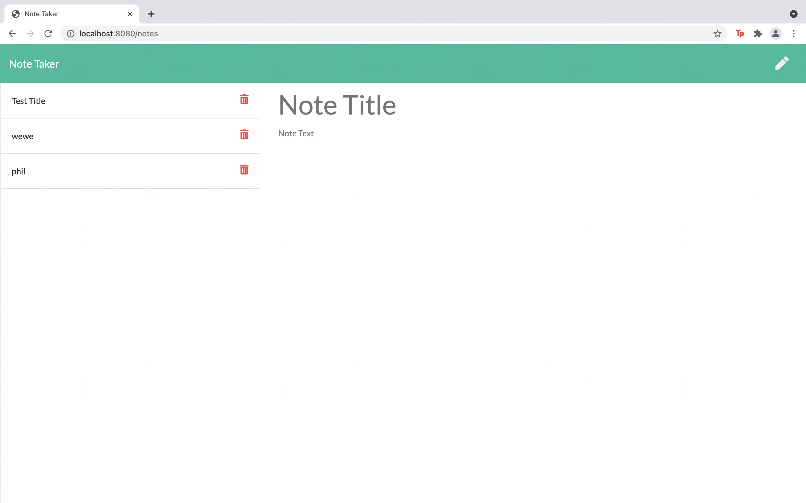
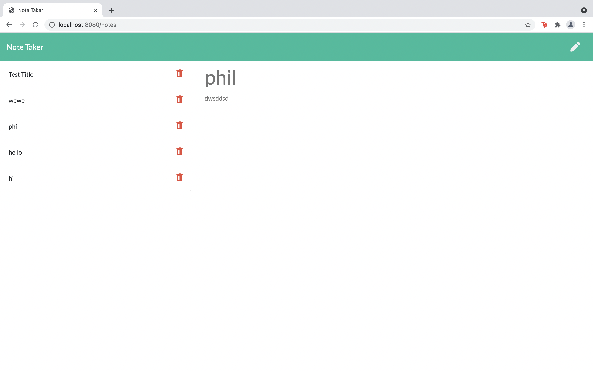
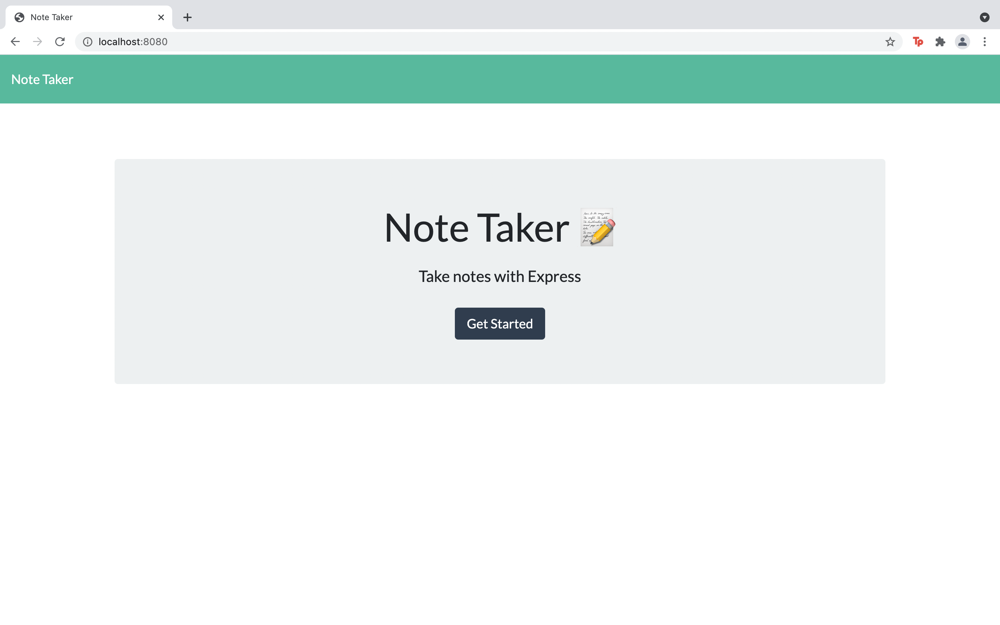

Work Profile note taker 

this app allows you to take notes and delete them quickly while at work and on the go

the user must click on the pencil icon to start a new note 
 
when finished the use needs to click on the save icon to save

the infomation will then be saved on the left side for esay access

when the note is no longer needed the user can delete it by press the trash can 

beside the desired note or notes.

